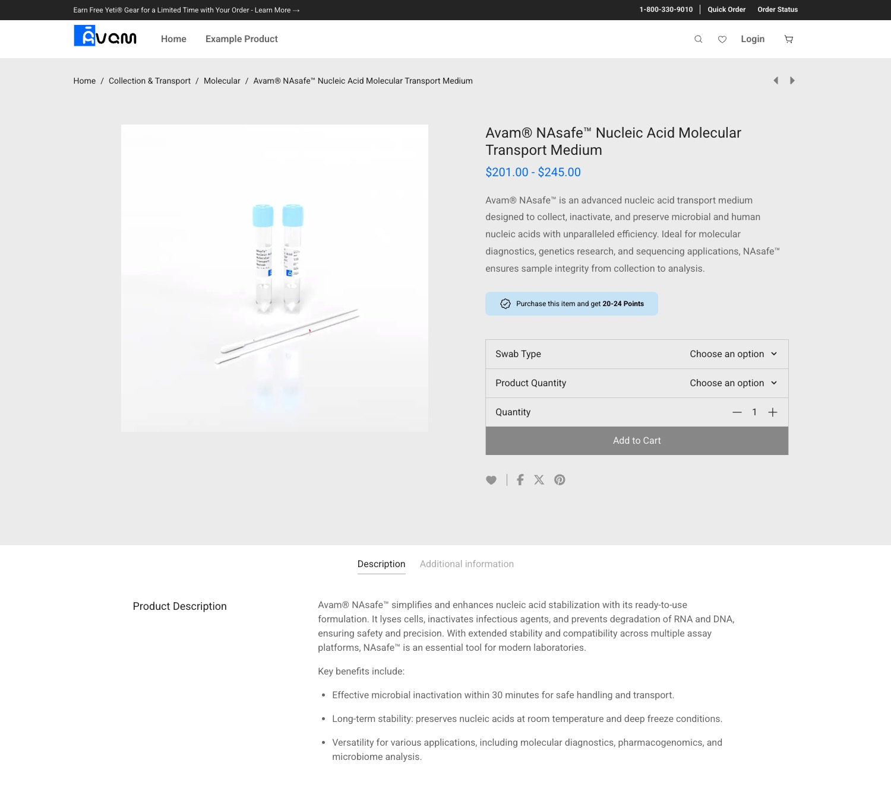

# Avam Product Demo

A simplified e-commerce product detail page built with Next.js, showcasing modern development practices for a science/tech brand. This demo focuses on component architecture, responsive design, and clean UI implementation using mock data.



## 🚀 Live Demo

**[View Live Demo →](https://avam-product-demo.vercel.app/products/avam-nasafe)**

## Tech Stack

- **Next.js 15** with App Router and Server Components for optimal performance
- **React 19** with modern patterns and concurrent features
- **TypeScript 5** for type safety and developer experience
- **Tailwind CSS 4** for utility-first styling and design consistency
- **Node 22** for the latest JavaScript features and performance

## Getting Started

### Prerequisites
- Node.js 22+
- pnpm (recommended) or npm

### Installation

```bash
# Clone the repository
git clone <repository-url>
cd avam-product-demo

# Install dependencies
pnpm install

# Start development server
pnpm dev
```

Open [http://localhost:3000](http://localhost:3000).

## Project Structure

```
src/
├── app/            # Next.js app routes and pages
├── modules/        # Domain-specific components and logic
├── types/          # TypeScript type definitions
├── utils/          # Helper functions and utilities
├── lib/            # Shared libraries and configurations
├── mocks/          # Mock data for product simulation
└── styles/         # App styles
```


## Scripts

```bash
pnpm dev          # Start development server
pnpm build        # Build for production
pnpm start        # Start production server
pnpm lint         # Run Biome linter
pnpm lint:fix     # Run Biome fix
```
